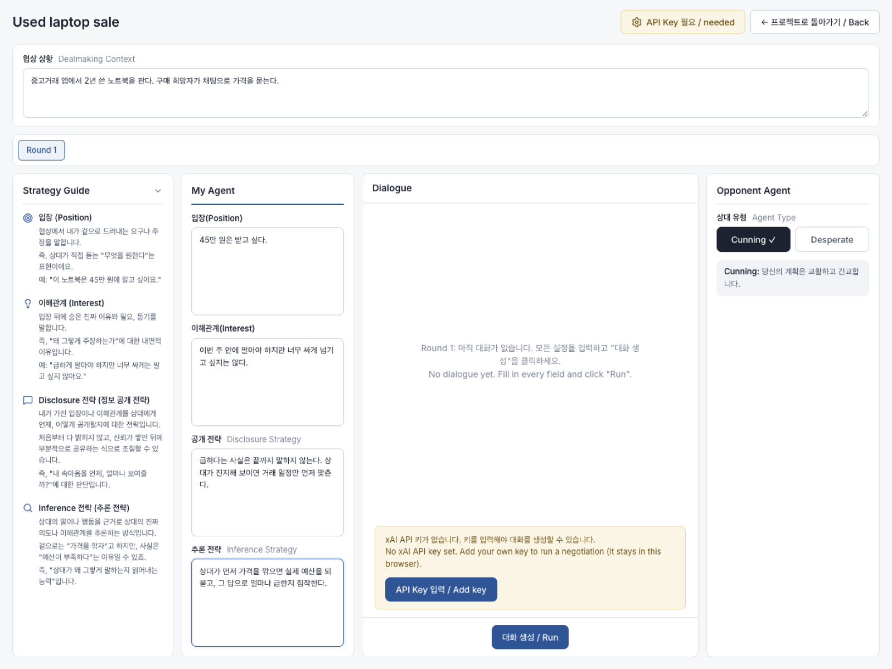

# Artificial Social Actor (ASA): Delegating a Negotiation to an LLM Agent

[](https://able0401.github.io/artificial-social-actor-demo/)
[](https://react.dev/)
[](https://vitejs.dev/)
[](https://docs.x.ai/)
[](LICENSE)

> You tell an AI agent what you want from a negotiation, what you are willing to reveal and how to read the other side. It then negotiates for you against another agent, and you can read its reasoning after every turn.



<sub>The simulation page with an example scenario filled in: shared context on top, the strategy guide on the left, your agent's four fields, the dialogue pane and the opponent type.</sub>

---

## Contents

- [Overview](#overview)
- [Research background](#research-background)
- [Live demo](#live-demo)
- [How it works](#how-it-works)
- [Bring your own key](#bring-your-own-key)
- [Privacy](#privacy)
- [Run locally](#run-locally)
- [Deploy your own](#deploy-your-own)
- [Project layout](#project-layout)
- [Citation](#citation)
- [License](#license)
- [Contact](#contact)
- [한국어 안내](#한국어-안내)

---

## Overview

An Artificial Social Actor (ASA) is an LLM agent that takes part in a social interaction in place of its user. Negotiation is the hardest version of that job. The agent has to guess what the other side really wants, decide how much of its user's situation to give away, and change course as the conversation moves.

This repository is a self-contained public version of the research prototype used in a user study of how people configure such an agent. You set up your agent with four fields, pick an opponent, and watch the two agents negotiate turn by turn. Under each of your agent's messages you can see the reasoning the model produced for that turn, so you can tell whether it did what you meant or only what you wrote.

The research code ran on Supabase with study accounts. This version keeps the same prompts, model and turn structure but stores everything in your browser and uses your own xAI key.

## Research background

The prototype comes from the master's thesis below.

> Hyun Seung Moon. *When I Need a Stand-in: Building Artificial Social Actors for Negotiation with User-Guided Inference and Disclosure* (대역이 필요할 때: 사용자가 조정하는 추론과 정보 공개 기반 협상 에이전트 설계 연구). Master's thesis, Department of Industrial Design, KAIST. Defended December 2025. Advisor: Tak Yeon Lee.

LLMs can now hold a strategic conversation well enough that handing one a negotiation is a real option, but we know little about how people want to hand it over. The thesis asks two questions. How should a user steer the agent's reading of the other party (inference) and its release of the user's own information (disclosure)? And how does that steering change with the kind of negotiation?

The four input fields put that question into the interface. Position and interest come from principled negotiation (Fisher and Ury's *Getting to Yes*): the position is what you ask for out loud, the interest is why you ask for it. Disclosure and inference strategy are the two things the thesis studies.

| Field | What you write | Example |
|---|---|---|
| Position (입장) | The demand you state openly | "I want 450,000 won for this laptop." |
| Interest (이해관계) | The reason behind the position | "I need to sell this week, but not too cheaply." |
| Disclosure strategy (공개 전략) | When and how much of the above the agent may reveal | "Never say that I am in a hurry." |
| Inference strategy (추론 전략) | How the agent should read the other side's real intent | "If they haggle first, ask what their budget is." |

In the study, 12 participants first wrote down negotiations they would like to hand off, then set up an ASA for three of them in this interface, ran the simulation, revised their settings and ran it again, and closed with an interview. The thesis reports the findings.

## Live demo

**Try it:** <https://able0401.github.io/artificial-social-actor-demo/>

You need an xAI API key to generate dialogue (see [Bring your own key](#bring-your-own-key)). Without a key you can still create projects and fill in every field.

## How it works

1. **Enter a nickname.** There is no account and no password. The nickname only labels your projects inside this browser.
2. **Create a project** and open it.
3. **Write the dealmaking context** (협상 상황), the scenario both agents share.
4. **Fill in "My Agent"** with the four fields above. The Strategy Guide panel on the left explains each field with examples.
5. **Pick the opponent type.** *Cunning* plays a sly, aggressive counterpart. *Desperate* pleads and dramatises hardship. The opponent agent sees only the shared context and its persona, never your fields.
6. **Click "대화 생성 / Run".** The agents alternate, yours first, for up to 20 turns (10 each) or until one of them ends the conversation. Each turn is a separate model call and messages appear as they arrive. **Stop** aborts mid-run.
7. **Read the reasoning.** A 💭 line under each of your agent's messages shows the reasoning the model gave for that turn. The opponent's reasoning is generated too but hidden, as it was in the study.
8. **Try another round.** When a run finishes, the round is marked complete and a new round tab appears with the same settings and an empty dialogue, so you can change your strategy and run again. **Reset** clears the current round.

| Setting | Value (same as the study) |
|---|---|
| Model | `grok-4-0709` (changeable in the key panel) |
| Temperature | 0.7 |
| Output | JSON with `message` and `reasoning` per turn |
| Turn limit | 20 (10 per agent), or earlier when an agent ends the talk |

## Bring your own key

The demo calls the xAI API directly from your browser and ships without any key.

1. Create a key at <https://console.x.ai>.
2. In the app, click the **API Key** button (top right on the projects page and the simulation page).
3. Paste the key and save. You can also enter a different xAI model id; the default is `grok-4-0709`, the model used in the study.

The key is stored in your browser's `localStorage` under `asa.apiKey` and is sent only to `https://api.x.ai/v1`. Usage is billed to your xAI account. **Clear key** in the same panel removes it.

## Privacy

Everything stays in your browser. Nicknames, projects, dialogues and the API key live in `localStorage`. There is no backend, no database and no analytics, and the only network traffic is your own requests to the xAI API. Clearing site data for the page removes everything.

## Run locally

Requires Node.js 20.19 or later (Vite 7).

```bash
git clone https://github.com/Able0401/artificial-social-actor-demo.git
cd artificial-social-actor-demo
npm install
npm run dev
```

Open the URL Vite prints (usually http://localhost:5173) and add your key in the app.

## Deploy your own

The build is static (`dist/`). `VITE_BASE_PATH` sets the URL prefix; keep the default `/` unless you serve from a sub-path. The build also writes a copy of `index.html` to `dist/404.html` so client-side routes survive a refresh on static hosts.

**Vercel.** Import the repository. The included `vercel.json` sets the build command, output directory and SPA rewrite. No environment variables are needed.

**GitHub Pages.** The live demo is served from the `gh-pages` branch of this repository (Settings → Pages → Deploy from a branch → `gh-pages`, folder `/`). To publish a fork the same way:

```bash
VITE_BASE_PATH=/<repo-name>/ npm run build
npx gh-pages -d dist --dotfiles
```

`--dotfiles` keeps the `.nojekyll` marker so Pages serves `dist/` as is. You can put `VITE_BASE_PATH=/<repo-name>/` in a `.env` file instead (see `.env.example`).

## Project layout

```
src/
  components/SettingsPanel.jsx  BYOK settings modal and gear button
  contexts/AppContext.jsx       nickname and project state (localStorage)
  lib/db.js                     localStorage replacement for the study database
  lib/settings.js               API key and model storage helpers
  pages/LoginPage.jsx           nickname entry
  pages/ProjectsPage.jsx        project list
  pages/SimulationPage.jsx      negotiation interface, prompts and model calls
```

## Citation

If you use this prototype or the four-field setup in your work, please cite the thesis:

```bibtex
@mastersthesis{moon2025standin,
  title  = {When I Need a Stand-in: Building Artificial Social Actors for Negotiation with User-Guided Inference and Disclosure},
  author = {Moon, Hyun Seung},
  school = {Korea Advanced Institute of Science and Technology (KAIST)},
  type   = {Master's thesis},
  note   = {Department of Industrial Design. Defended December 2025. In Korean.},
  year   = {2025}
}
```

## License

MIT. See [LICENSE](LICENSE).

## Contact

Hyun Seung Moon, Ph.D. student, KAIST Industrial Design (AI Experience Lab)
[mzes0401@kaist.ac.kr](mailto:mzes0401@kaist.ac.kr) · [hyunseungmoon.net](https://hyunseungmoon.net)

---

## 한국어 안내

ASA(Artificial Social Actor)는 협상을 AI 에이전트에게 맡기는 연구 프로토타입입니다. 문현승의 KAIST 산업디자인학과 석사논문 「대역이 필요할 때: 사용자가 조정하는 추론과 정보 공개 기반 협상 에이전트 설계 연구」(2025년 12월 심사)에서 사용자 스터디에 쓴 인터페이스를 누구나 브라우저에서 써 볼 수 있게 옮겼습니다.

협상 상황을 적고 내 에이전트의 입장, 이해관계, 공개 전략, 추론 전략을 입력한 뒤 상대 유형(Cunning / Desperate)을 고르면 두 에이전트가 실시간으로 협상합니다. 내 에이전트의 발언 아래에는 그 턴에 모델이 내놓은 판단 근거가 함께 보입니다.

- 실행: `npm install` 후 `npm run dev`.
- 로그인: 비밀번호 없는 닉네임입니다. 이 브라우저 안에서 프로젝트를 구분하는 데만 쓰입니다.
- API 키: <https://console.x.ai>에서 발급받아 앱 오른쪽 위 **API Key** 버튼에 붙여 넣습니다. 키는 이 브라우저의 localStorage(`asa.apiKey`)에만 저장되고 `https://api.x.ai/v1`로만 전송됩니다.
- 모델, 온도, JSON 출력 형식은 연구 때와 같습니다 (`grok-4-0709`, 0.7).
- 닉네임, 프로젝트, 대화, 키는 모두 브라우저에만 저장되며 서버는 없습니다.
